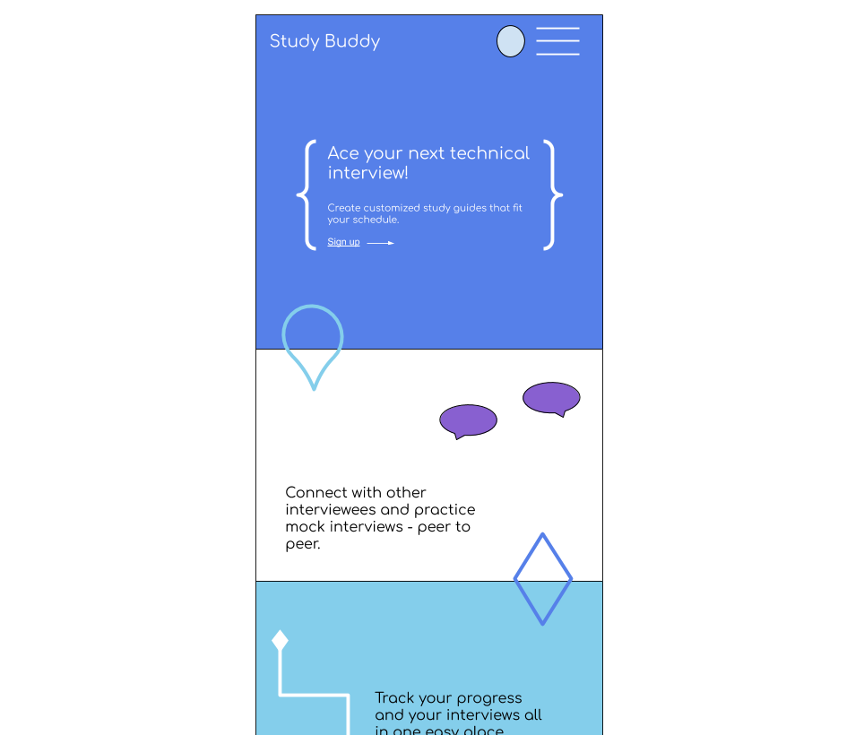
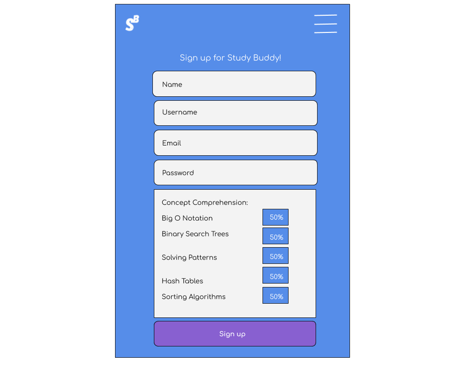
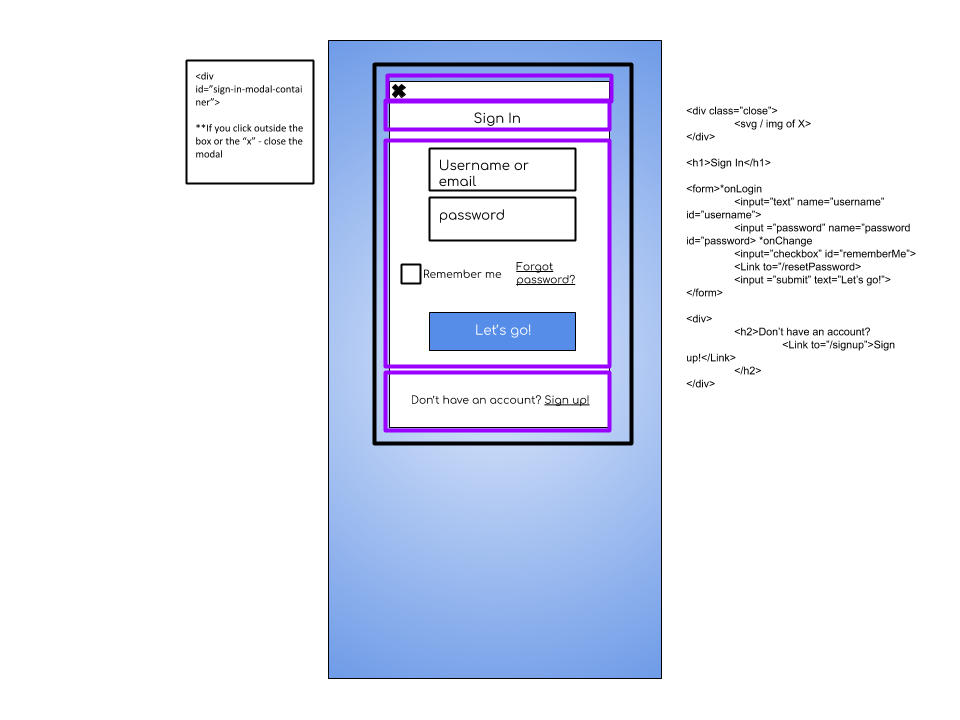
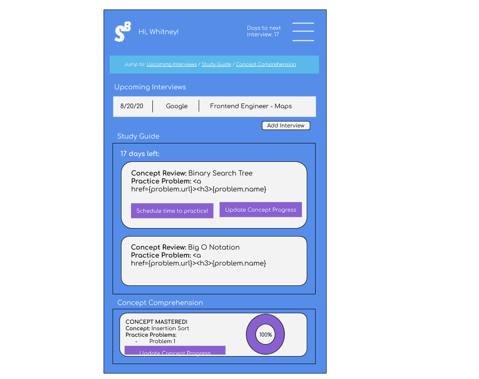
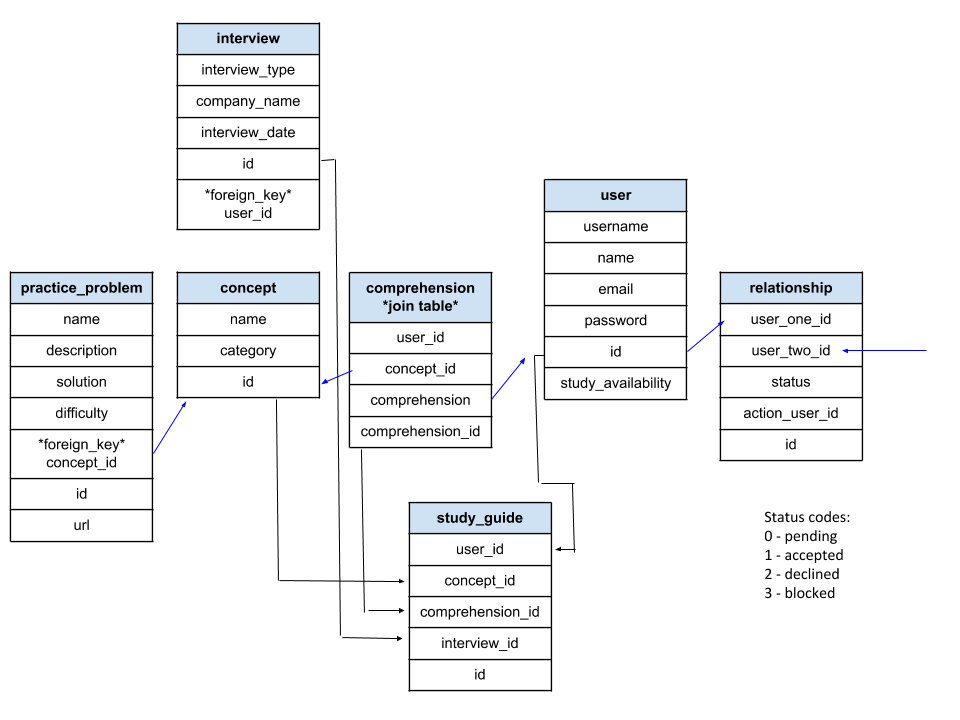

# Study Buddy

## Table of Contents
[Description]()
[User Stories & Wireframes]()
[Future Improvements]()
[Project Schedule]()
[Time Tracker]()

## Description
While preparing for a technical interview have you wished you could keep better track of what interviews you have coming up? Remembering which concepts you still need more practice on? Finding good problems to practice specific concepts? Look no further!

Study Buddy is an app that allows a user to track their interviews, studying progress and practice problems for specific concepts all in one easy place. 

Next implementations will involve producing custom study tracks & concept questions based on language, concept understanding, time available to study per day and amount of time left until interview. 

In the future, I would like to make a community forum aspect, where you can connect with other users to schedule mock interviews. This will be a one-stop-shop to organize & implement a study strategy for technical interviews.

## User Stories & Wireframes
- A user can create a new profile or login to an existing profile
- In their profile, a user can create a new upcoming interview - inputting the interview date, company, language(s), and targeted job position
- User will be able to see time left until the soonest interview in their profile & how many study hours they have left (using avg. time to study per day)
- User will be able to see interview concept cards in their profile
- User will be able to see & update their individual progress towards comprehension of the concepts in the concept cards
- User will be able to see x number of practice problems in the concept card that support practice for that concept, including difficulty & link to solution
- User will be able to see a link to more practice problems in various coding sites that are applicable to that concept

### Landing Page

### Sign Up Form

### Login Form

### Profile Page

### Data Tables Wireframe

## Future Improvements
- Implement 3rd party API to automatically pull random questions in specified language & concept category to display on concept card instead of linked via url only
- User has ability to schedule time to review certain concepts / problems in their google calendar / iCal to set aside time to practice
- User is able to see a calendar view of their time to practice, on top of being able to schedule in linked calendar
- Create further AI & learning of the app & algorithms > giving suggested study path based on concept understanding the user picks, as user reaches “high comprehension” i.e. close to 100 progress on a concept, focus on giving more problems in other concept areas with “less comprehension”. 
- Further use of job profiles - linked to certain skills & highlighting specific concept areas over others. 
- Create a community function; users are able to connect, schedule mock interviews together and track their progress via their concept tracker in tandem with feedback from their mock interviewers. Peer to peer.

## Project Schedule

## Time Tracker

This project was bootstrapped with [Create React App](https://github.com/facebook/create-react-app).

